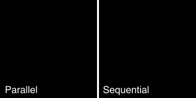

#### <sup>:movie_camera: [pellicola](../README.md) → [Documentation](./README.md) → Generating video files</sup>

---

## Generating video files

Once you have a sketch function up and running (see [‘Writing a sketch’][sketch]), you can use it with `pellicola` to get your canvas-based animation out of the browser and into a video file.

In this example, we save our video to a `videos` directory relative to where we are currently working and name it `my-sketch.mp4`:

```js
const pellicola = require('pellicola')
const sketch = require('./my-sketch.js') // file that exports a sketch function

const settings = {
  duration: 1,
  outDir: 'videos',
  filename: 'my-sketch.mp4'
}

pellicola(sketch, settings)
  .then(path => console.log('Video saved at:', path))
```

By default, `pellicola` would save the video as `out.mp4` in the current working directory.

`pellicola` returns a `Promise` for the video’s path once it has been saved, so it can be used either with the `.then()` syntax shown above or using `await` in asynchronous functions. For example we might want to generate our video at several different lengths:

```js
const durations = [1, 5, 10]

durations.forEach(async duration => {
  const settings = {
    duration,
    filename: `sketch-${duration}s.mp4`
  }
  const path = await pellicola(sketch, settings)
  console.log(`${duration}s video saved at: ${path}`)
})
```

### Possible settings for `pellicola`

The second argument to `pellicola` is an object configuring how your video will be generated. Some of the options impact how your canvas is drawn, while others control how the video is compiled.

All settings are optional, except that you must include one of either `duration` or `totalFrames` to set how long your video will last.

variable           | default      | description
-------------------|--------------|---------------------------------------------------------------------
`dimensions`       | `[640, 480]` | Sets `[width, height]` of your video
`duration`         |              | Sets the duration of your video in seconds
`filename`         | `'out.mp4'`  | Sets the filename of your video
`fonts`            |              | An array of custom fonts to load (see [‘Using custom fonts’][fonts])
`fps`              | `24`         | Number of frames per second in the animation
`frame`            | `0`          | Sets the frame on which your video starts
`frameFormat`      | `'png'`      | Sets canvas export format: either `'png'` or `'jpeg'`
`maxConcurrency`   | `16`         | If `renderInParallel` is `true`, sets maximum number of frames to render in parallel
`motionBlur`       |              | Configure motion blur (see [‘Rendering with motion blur’][motion-blur])
`outDir`           | `'.'`        | Path to the directory to save your video in
`renderInParallel` | `false`      | If true, renders each frame in parallel in separate canvas contexts
`silent`           | `false`      | If true, doesn’t show progress spinners in your Terminal
`time`             | `0`          | Sets the time at which your video starts
`totalFrames`      |              | Sets the duration of your video in frames

### Rendering frames sequentially or in parallel

By default, `pellicola` renders each frame sequentially allowing you to potentially draw cumulatively — each frame is drawn over the top of the previous frame.

If appropriate for your sketch, you can instead ask `pellicola` to generate all frames in parallel in their own independent contexts. In this case each frame is isolated and will not be impacted by its predecessors:

```js
pellicola(sketch, { renderInParallel: true, duration: 3 })
```

The differences between sequential and parallel rendering can be significant and it may be easier to understand by seeing a sketch rendered in both ways:

<p align="center">
  
</p>

On the left, frames are isolated and each frame contains only a single, translucent red rectangle. On the right, each frame is drawn over its predecessor and the translucent rectangles reinforce each other to create a bright blurred smear as the animation progresses.

[sketch]: ./writing-a-sketch.md
[fonts]: ./using-custom-fonts.md
[motion-blur]: ./rendering-with-motion-blur.md

---

#### <sup>[← Back to Documentation](./README.md)
