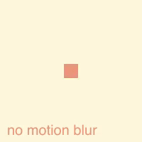
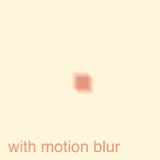

#### <sup>:movie_camera: [pellicola](../README.md) → [Documentation](./README.md) → Rendering with motion blur</sup>

---

## Rendering with motion blur

With `pellicola`’s default rendering settings, movement can sometimes seem unnaturally smooth (for high frame rates) or jerky as we perceive a moving object as jumping in position from frame to frame. When filming a moving object with a camera, the captured frame will be slightly blurred as the object was never perfectly still during filming, and this motion blur helps us perceive the movement as natural.

For example, we might have a sketch like this that draws a square bouncing across our canvas:

```js
const sketch = () => ({ context, width, height, playhead }) => {
  const x = Math.sin(playhead * 2 * Math.PI)
  const h = 20
  context.fillStyle = 'cornsilk'
  context.fillRect(0, 0, width, height)
  context.fillStyle = 'darksalmon'
  context.fillRect(
    width / 3 * x + width / 2 - h / 2,
    height / 3 * x + height / 2 - h / 2,
    h, h
  )
}
```

Let’s try to render this sketch:

```js
pellicola(sketch, { duration: 2, dimensions: [200, 200] })
```

It  works but the movement of the square doesn’t seem quite natural:

<p align="center">
  
</p>

`pellicola` provides an option to simulate motion blur by drawing each frame multiple times at small time increments, and averaging the result. Let’s try using it for the same sketch by passing `pellicola` a `motionBlur` options object:

```js
pellicola(
  sketch,
  {
    duration: 2,
    dimensions: [200, 200],
    motionBlur: {
      samplesPerFrame: 10,
      shutterAngle: 0.9
    }
  }
)
```

And the result:

<p align="center">
  
</p>

As you can see, motion blur only impacts moving parts of the canvas, static objects will remain crisp. Depending on the kind of movement used in your sketch, you can experiment with the motion blur options to find a result you like.

### Configuring motion blur

To render with motion blur you pass `pellicola` a `motionBlur` object with the following properties.

1. #### `samplesPerFrame`
  
  Type: `Number` (must be an integer greater than `0`)

  You can think of `samplesPerFrame` as a “quality” setting for motion blur. If `samplesPerFrame` is `1` then no motion blur is applied because each frame is drawn just once. As you increase `samplesPerFrame`, your render function will be called for each sample. A higher number means a smoother blur, but will also mean more calculations and a slower render.

2. #### `shutterAngle`
  
  Type: `Number`  
  Default: `1`
  
  `shutterAngle` impacts how spaced out your samples are.
  
  If `shutterAngle` is `1` and `samplesPerFrame` is `4`, then you are effectively sampling frames `0`, `0.25`, `0.5`, and `0.75` for the first frame of your sketch, frames `1`, `1.25`, `1.5`, and `1.75` for the second frame, etc.
  
  If we reduce `shutterAngle` to `0.5`, then for the first frame of a sketch we would be sampling frames `0`, `0.125`, `0.25`, and `0.375`. The samples are closer together but there is a bigger jump to the next frame.
  
  If we increase `shutterAngle` to a larger number like `2`, then we essentially overlap frames, sampling frames `0`, `0.5`, `1`, and `1.5` for the first frame.

### Credits

`pellicola`’s motion blur technique is adapted from [this Processing sketch][gist] by Etienne Jacob, who [credits][tut] the approach to Dave Whyte of [bees & bombs][b&b].

[gist]: https://gist.github.com/Bleuje/e06d3b23abe45c4d04973b8b0f90b7a4#file-templateexample-pde-L36-L58
[tut]: https://necessarydisorder.wordpress.com/2018/07/02/getting-started-with-making-processing-gifs-and-using-the-beesandbombs-template/
[b&b]: https://beesandbombs.tumblr.com/

---

#### <sup>[← Back to Documentation](./README.md)
